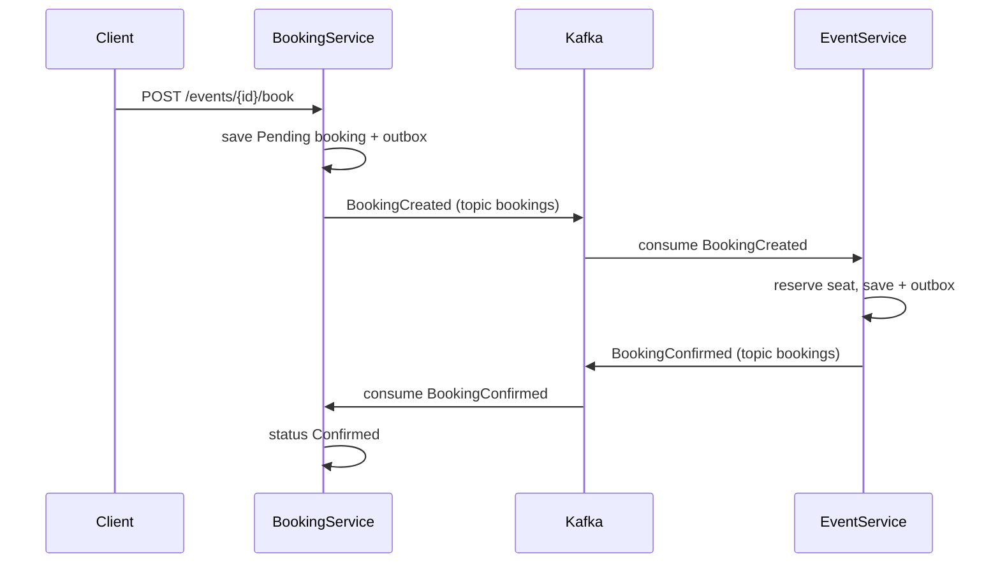

# MicroserviceCourse — система управления мероприятиями

Микросервисное приложение для управления событиями и бронированиями.  
Реализовано на **ASP.NET Core 10**, **PostgreSQL**, **Apache Kafka** и **чистой архитектуре**.

---

## Оглавление

- [Состав системы](#состав-системы)
- [Архитектура](#архитектура)
- [Поток данных через Kafka](#поток-данных-через-kafka)
- [Запуск проекта](#запуск-проекта)
- [API Endpoints](#api-endpoints)
- [Аутентификация и авторизация](#аутентификация-и-авторизация)
- [Тестирование](#тестирование)

---

## Состав системы

| Компонент | Назначение | Порт (Docker / локально) |
|-----------|------------|--------------------------|
| **UserService** | Регистрация, вход, выдача JWT | 5134 / 5134 |
| **EventService** | CRUD событий, учёт мест | 5191 / 5191 |
| **BookingService** | Создание и отмена броней | 5099 / 5099 |
| **users-db** | PostgreSQL для UserService | 5433 |
| **events-db** | PostgreSQL для EventService | 5434 |
| **bookings-db** | PostgreSQL для BookingService | 5435 |
| **Kafka + Zookeeper** | Асинхронный обмен сообщениями | 9092 |

Общие проекты:

- `Shared.Domain` — контракты событий (`BookingConfirmed`, `BookingCreated` и др.), константы топиков Kafka (`KafkaTopics`), общие сущности outbox/inbox
- `Shared.Api` — JWT-аутентификация, Swagger, настройки

---

## Архитектура

Каждый микросервис построен по принципам **Clean Architecture** (4 слоя):

```
{Service}.Domain          # Сущности, исключения, доменные правила
        ↑
{Service}.Application     # Use cases, DTO, интерфейсы портов
        ↑
{Service}.Infrastructure # EF Core, репозитории, Kafka producer
        ↑
{Service}.Api             # Контроллеры, DI, BackgroundService
```

- У каждого сервиса **своя база данных** и **свои миграции EF Core**
- Связь между сервисами — только по идентификаторам (`UserId`, `EventId`, `BookingId`) через Kafka
- Прямых HTTP-вызовов между сервисами нет

---

## Поток данных через Kafka

### Создание и подтверждение брони



### Контракт BookingCreated

Определён в [`Shared/Shared.Domain/Contracts/Booking/BookingCreated.cs`](Shared/Shared.Domain/Contracts/Booking/BookingCreated.cs):

| Поле | Тип | Описание |
|------|-----|----------|
| `BookingId` | Guid | Идентификатор брони |
| `EventId` | Guid | Идентификатор события |
| `UserId` | Guid | Идентификатор пользователя |
| `SeatCount` | int | Количество мест (по умолчанию 1) |
| `CreatedAt` | DateTime | Момент создания брони (UTC) |

При создании брони клиент передаёт количество мест в теле запроса:

```json
POST /events/{eventId}/book
{
  "seatCount": 2
}
```

Имена топиков вынесены в [`Shared/Shared.Domain/Kafka/KafkaTopics.cs`](Shared/Shared.Domain/Kafka/KafkaTopics.cs):

- `KafkaTopics.Bookings` — `"bookings"` (события бронирования)
- `KafkaTopics.Events` — `"events"` (события домена Events, например `EventDeleted`)

### Outbox / Inbox

Каждый сервис использует паттерн **Transactional Outbox** для надёжной публикации и **Inbox** для идемпотентной обработки входящих сообщений.

---

## Запуск проекта

### Вариант 1: Вся система в Docker (рекомендуется)

```bash
git clone https://github.com/nizuc-a/MicroserviceCource.git
cd MicroserviceCource
git checkout sprint-9
docker compose up --build
```

Поднимаются Zookeeper, Kafka, три базы данных и три API-сервиса. Миграции применяются автоматически при старте.

| Сервис | Swagger |
|--------|---------|
| UserService | http://localhost:5134/swagger |
| EventService | http://localhost:5191/swagger |
| BookingService | http://localhost:5099/swagger |

Остановка:

```bash
docker compose down
```

### Вариант 2: Локальный запуск API

Поднять только инфраструктуру:

```bash
docker compose up -d zookeeper kafka kafka-init users-db events-db bookings-db
```

Запустить каждый API в отдельном терминале:

```bash
cd UserService/UserService.Api && dotnet run
cd EventService/EventService.Api && dotnet run
cd BookingService/BookingService.Api && dotnet run
```

При локальном запуске используются порты и строки подключения из `appsettings.json` каждого сервиса.

---

## API Endpoints

### UserService (http://localhost:5134)

| Метод | Эндпоинт | Описание | Доступ |
|-------|----------|----------|--------|
| POST | `/auth/register` | Регистрация пользователя | Без токена |
| POST | `/auth/login` | Получение JWT-токена | Без токена |

### EventService (http://localhost:5191)

| Метод | Эндпоинт | Описание | Доступ |
|-------|----------|----------|--------|
| GET | `/events` | Список событий (пагинация, фильтры) | Admin, User |
| GET | `/events/{id}` | Событие по ID | Admin, User |
| POST | `/events` | Создать событие | Admin |
| PUT | `/events/{id}` | Обновить событие | Admin |
| DELETE | `/events/{id}` | Удалить событие | Admin |

### BookingService (http://localhost:5099)

| Метод | Эндпоинт | Описание | Доступ |
|-------|----------|----------|--------|
| POST | `/events/{eventId}/book` | Создать бронь | Admin, User |
| GET | `/bookings` | Брони текущего пользователя | Admin, User |
| GET | `/bookings/{id}` | Бронь по ID | Admin, User |
| DELETE | `/bookings/{id}` | Отменить бронь | Admin, User |

---

## Аутентификация и авторизация

JWT-токен выдаёт **UserService** (`POST /auth/login`). **EventService** и **BookingService** проверяют тот же токен.

Параметры JWT одинаковы во всех сервисах (секция `"Jwt"` в `appsettings.json`):

- [`UserService/UserService.Api/appsettings.json`](UserService/UserService.Api/appsettings.json)
- [`EventService/EventService.Api/appsettings.json`](EventService/EventService.Api/appsettings.json)
- [`BookingService/BookingService.Api/appsettings.json`](BookingService/BookingService.Api/appsettings.json)

Общая конфигурация: [`Shared/Shared.Api/JwtAuthenticationExtensions.cs`](Shared/Shared.Api/JwtAuthenticationExtensions.cs).

### Получение токена через Swagger

1. Откройте Swagger UserService: http://localhost:5134/swagger
2. Зарегистрируйте пользователя через `POST /auth/register`:
   ```json
   {
     "login": "admin",
     "password": "admin123",
     "role": "Admin"
   }
   ```
3. Получите токен через `POST /auth/login`
4. Нажмите **Authorize** в Swagger EventService или BookingService и введите: `Bearer {ваш_токен}`

### Ролевая модель

| Роль | Права |
|------|-------|
| `User` | Бронирование, просмотр событий и своих броней, отмена своих броней |
| `Admin` | Все права User + CRUD событий, отмена любых броней |

---

## Тестирование

```bash
dotnet test
```

| Проект | Описание |
|--------|----------|
| `UserService.UnitTests` | Юнит-тесты AuthService |
| `EventService.UnitTests` | Юнит-тесты EventService, BookEvent |
| `BookingService.UnitTests` | Юнит-тесты BookingService |
| `*.IntegrationTests` | Интеграционные тесты с PostgreSQL (Testcontainers) |

Для интеграционных тестов требуется запущенный Docker.

---

## Сценарий проверки end-to-end

1. Зарегистрируйте пользователя и получите JWT в UserService
2. Создайте событие (Admin) в EventService, запомните `totalSeats` / `availableSeats`
3. Создайте бронь в BookingService (`POST /events/{id}/book`)
4. Дождитесь подтверждения (статус `Confirmed`) — сообщение проходит через Kafka
5. Проверьте в EventService, что `availableSeats` уменьшилось на значение `seatCount` из запроса
